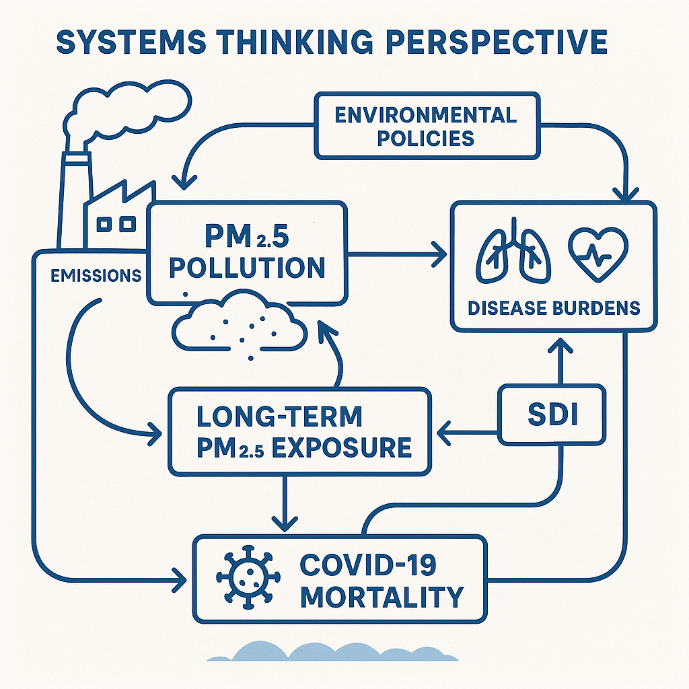

# Summary of Group's Understanding of the Problem Domain

Our project focuses on the link between **urban air pollution** and **public health
outcomes**, particularly respiratory and cardiovascular diseases. We approach this
issue through a **systems thinking lens**, recognizing that air pollution is not
just a byproduct of emissions, but part of a **dynamic, interconnected system**.

This system includes **policy choices, socioeconomic conditions, atmospheric
processes**, and **health outcomes**. For example, a change in traffic regulations
may reduce emissions, leading to improved air quality. This can lower health
burdens and enhance workforce productivity, which then feeds back into future
policy decisions. Understanding these **feedback loops** allows us to frame the
problem more holistically. It helps account not only for direct causes but also for
indirect effects and long-term implications.

Each city is assigned an **Air Quality Index (AQI)** score. This score reflects the
**severity of pollution** based on the concentration of the most harmful pollutant
at that time. It is not an average of all pollutants. The AQI falls into levels,
which are: *Good*, *Moderate*, *Unhealthy for Sensitive Groups*, *Unhealthy*, *Very
Unhealthy*, *Hazardous*, and each level corresponds to a specific health risk.

The primary pollutants that determine AQI are **PM2.5**, **O₃ (ozone)**,
**NO₂ (nitrogen dioxide)**, and **CO (carbon monoxide)**. Each pollutant is linked
to specific health effects. For example, PM2.5 affects cardiovascular and
respiratory systems, ozone impairs lung function, NO₂ worsens asthma, and CO
interferes with oxygen delivery in the body.

With this in mind, we aim to:

- **Classify cities by their dominant pollutants**
- **Understand how these pollution profiles align with respiratory and**
  **cardiovascular health outcomes**
- **Identify regional patterns that can inform more targeted and system-aware**
  **interventions**

By connecting environmental data with public health evidence and lived
experiences, we aim to contribute to more compassionate, data-driven, and
system-conscious air quality solutions. These solutions should prioritize the
populations most at risk.
