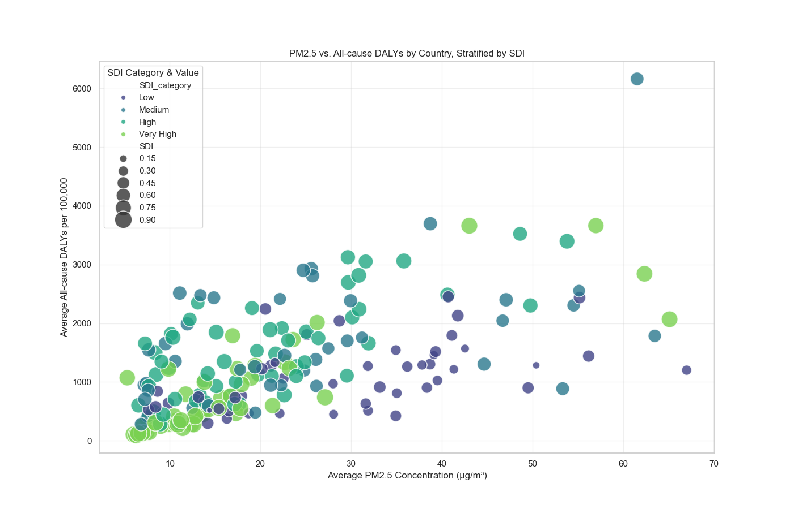

<!-- markdownlint-disable MD013 -->

# 

[![Typing SVG][badge-1]](https://git.io/typing-svg)  
**Atmosfear** is a data science project investigating the global health impacts of PM₂.₅, an
ultrafine pollutant small enough to penetrate deep into the lungs and bloodstream, yet pervasive enough to affect billions worldwide.

We explore how long-term exposure to PM₂.₅ has shaped the burden of cardiovascular and respiratory diseases across countries with varying levels of socio-demographic development.

Our goal is to humanize the data, to reveal the unequal health risks of polluted air and help inform more targeted, life-saving environmental and public health interventions.

---

[![Typing SVG][badge-2]](https://git.io/typing-svg)  
Air pollution is one of the most underestimated killers in the world today.
Unlike more visible threats, polluted air is invisible and easy to ignore
until it becomes personal. You can't see it, but it's there: silently entering
lungs, aggravating asthma, triggering heart conditions, and cutting lives
short.

According to the WHO (2023) and GBD (2024), air pollution contributes to an
estimated **7 million premature deaths each year** due to its strong links
with cardiovascular and respiratory diseases, stroke, and lung cancer. It's
not just an environmental crisis; it's a public health emergency hiding in
plain sight.

---

[![Typing SVG][badge-3]](https://git.io/typing-svg)  
One of our group members shared a personal story: her mother, who has asthma,
experiences severe discomfort when staying in cities where it is polluted.
Even short visits can mean weeks of relying on medications, constant coughing,
and the simple wish to breathe without pain. For her and millions with
similar and different health conditions, clean air isn’t just a preference,
it’s a necessity.
**But is it feasible to find cities where the air is truly safe for
vulnerable individuals?**  

*Located in the `0_domain_study` folder — [`problem_statement.md`](0_domain_study/problem_statement.md)*

---

[![Typing SVG][badge-6]](https://git.io/typing-svg)  
>**To what extent have ambient PM₂.₅ concentrations (2010–2019) influenced the burden of cardiovascular and respiratory diseases across countries with varying socio-demographic development levels, and how might this long-term exposure relate to COVID-19 mortality outcomes?**

 This question stems from our shared concern about the growing impact of air pollution on public health worldwide. It holds personal significance for us, as we’ve witnessed firsthand how polluted environments affect the well-being of our own communities. Our research is grounded in the broader context of global health inequities and shaped by the practical limitations of a defined research timeframe and the scope of publicly available data  

*Located in the `0_domain_study` folder — [`research_question.md`](0_domain_study/research_question.md)*

---

[![Typing SVG][badge-13]](https://git.io/typing-svg)  
Our analysis demonstrates that the Socio-Demographic Index (SDI) is the strongest predictor of country-level health burdens measured by Disability-Adjusted Life Years (DALYs), consistently explaining the largest share of variance across all-cause, cardiovascular, stroke, and respiratory diseases.
Ambient PM₂.₅ exposure is a significant secondary predictor, particularly for cardiovascular and stroke DALYs, where lagged (1–2 years) and moving-average (3- and 5-year) exposures improve model performance. This indicates that the health impacts of air pollution accumulate over multiple years rather than manifesting immediately.
Furthermore, the interaction between SDI and PM₂.₅ reveals that countries with lower socio-demographic development experience greater vulnerability to pollution-related health effects, with stronger marginal impacts observed in these populations.
Regarding COVID-19 mortality, using 2020 death data and a 10-year average of PM₂.₅ exposure, the study found a modest but consistent association between pollution and increased mortality rates. Although the predictive power was lower than for DALYs, PM₂.₅ and SDI remained relevant predictors across multiple modeling approaches, suggesting that air pollution may exacerbate vulnerability to acute respiratory disease outcomes.

---

[![Typing SVG][badge-4]](https://git.io/typing-svg)  
A brief overview of our shared insights on global air pollution, its health
impacts, and why a deeper pollutant-specific analysis is needed.

*Located in the `0_domain_study` folder — [`sum_of_group_understanding.md`](0_domain_study/sum_of_group_understanding.md)*

---

[![Typing SVG][badge-5]](https://git.io/typing-svg)  
A focused review of key pollutants, global exposure trends, and the
limitations of current metrics like the AQI.

*Located in the `0_domain_study` folder — [`background_review.md`](0_domain_study/background_review.md)*

---

[![Typing SVG][badge-8]](https://git.io/typing-svg)  
In this project, we study how **long-term exposure to PM2.5** affects
**human health**. We use **country-level PM2.5 data**
and **disease burden estimates** for **respiratory and cardiovascular outcomes**
from the **Global Burden of Disease (GBD) study**.

We examine **trends in PM2.5 (2010–2019)** and their links to conditions like
**asthma, heart disease, and stroke**. Our analysis also considers the
**lag effect**—how past pollution levels may lead to health problems years later.

Additionally, we explore whether **long-term PM2.5 exposure** is related to
**higher COVID-19 mortality**, possibly due to pre-existing lung or heart damage.
We include the **Socio-demographic Index (SDI)** to assess how
**development level and healthcare access** influence these relationships.

By analyzing **pollution–health patterns** across diverse regions, we aim to produce
**clear, actionable insights** for public health.  

**Clean air is not just about the environment—it’s about protecting people’s lives.**

---

> *This animated bar chart visualizes the PM₂.₅ mean concentration across 25 selected countries to illustrate how pollution trends have changed over time in a focused subset of nations for better visual clarity and comparative insight.*

---

[![Typing SVG][badge-9]](https://git.io/typing-svg)  
Our analysis relies on country-level data, which can mask important within-country differences. For instance, national averages may overlook how air pollution disproportionately affects specific cities or vulnerable populations. While we investigate associations between long-term PM₂.₅ exposure and health outcomes including COVID-19 mortality our findings are observational and do not establish causality. The patterns identified represent correlations rather than proof of direct effects.  

Additionally, differences in how countries report health and mortality data may introduce inconsistencies that affect cross-national comparisons. Also, although COVID-19 mortality is included to provide broader context, we do not claim that air pollution directly caused COVID-19 deaths; rather, we examine how long-term exposure and socio-demographic conditions may relate to pandemic outcomes at the population level.

---

[![Typing SVG][badge-20]](https://git.io/typing-svg)  
Our study shows that **long-term exposure to fine air pollution particles (PM₂.₅) from 2010 to 2019** has had a clear impact on public health—especially **heart and lung diseases**. Countries with **higher pollution levels** generally had **worse health outcomes**, and this effect was **stronger in less developed nations**.

Pollution’s impact wasn’t random. It followed consistent patterns across models, with the **strongest effects** seen in **cardiovascular disease**. Countries like Egypt and Afghanistan faced both high pollution and high health burdens, revealing global health inequalities.

We also found that long-term pollution was **modestly but significantly associated with higher COVID-19 death rates in 2020**. This suggests that air pollution may increase vulnerability during pandemics, especially in countries with **weaker health systems**.

Encouragingly, pollution and disease rates have **declined** over time, showing real progress. Still, long-term pollution leaves lasting effects, especially in vulnerable populations.

**Cleaner air saves lives, and direct pollution reduction is vital where people are most at risk.**

---

[![Typing SVG][badge-14]](https://git.io/typing-svg)  
We conducted a multi-phase statistical and machine learning analysis to evaluate how  PM₂.₅ air pollution exposure influenced disease burden and COVID-19 mortality globally, while accounting for development levels using the Socio-Demographic Index (SDI).

1. Exploratory Data Analysis (EDA) to visualize trends in PM₂.₅, DALYs, SDI, and COVID-19 deaths.
2. Multiple Linear Regression (MLR) to assess baseline associations.
3. Random Forest models to detect nonlinearities and improve predictive performance.
4. Spline and Quantile Regression to evaluate nuanced interaction and distributional effects.
5. Interaction Models tested whether PM₂.₅ impacts differ across SDI levels

---

[![Typing SVG][badge-15]](https://git.io/typing-svg)  
Overall, the statistical confidence in the reported findings is well supported, particularly in the models estimating long-term health burdens (DALYs). Across both linear and nonlinear models, PM₂.₅ and SDI coefficients were statistically significant, with 95% confidence intervals generally excluding zero. The Random Forest regressors achieved high R² values –up to 0.79– indicating robust predictive performance, especially for all-cause and cardiovascular DALYs. These results are further substantiated by the consistency of feature importance rankings and directionality of effects across methods.
However, confidence in the COVID-19 mortality models is more cautious. While PM₂.₅ retained statistical significance, the overall model performance was moderate (R² ~0.40 at best), and confidence intervals for interaction effects particularly those involving PM₂.₅ × SDI terms, were wider and occasionally included zero. This suggests potential context-dependence or nonlinearity that is not fully captured by traditional parametric methods. Also, diagnostic checks indicated partial assumption violations and the presence of influential outliers, underscoring the complexity of modeling pandemic outcomes at the country level.
Despite these caveats, the evidence base across multiple modeling frameworks converges on the conclusion that PM₂.₅ exposure is a meaningful, though not dominant, predictor of both chronic disease burden and COVID-19 mortality. The findings should be interpreted with appropriate caution, acknowledging both the ecological nature of the data and the existence of unmeasured confounding factors, but they provide a credible foundation for further investigation and policy discussion.

---

[![Typing SVG][badge-16]](https://git.io/typing-svg)  

- **Ecological Fallacy**: Country-level analysis may not reflect individual-level risks.
- **Omitted Variables**: Key confounders like smoking, healthcare quality, and other pollutants were not included.
- **Data Uncertainty**: PM₂.₅ and DALY estimates rely on modeled data with inherent error margins.
- **Temporal Gaps**: COVID-19 deaths were measured only in 2020, while PM₂.₅ was averaged over the prior decade.

---

[![Typing SVG][badge-17]](https://git.io/typing-svg)  

- **Mixed-effects or fixed-effects models**: Apply panel data techniques to account for country-specific unobserved heterogeneity.
- **Subnational or individual-level data**: Collect and analyze finer-scale data for improved spatial and demographic resolution.
- **Causal inference methods**: Use approaches like difference-in-differences or instrumental variables to better isolate the causal effects of pollution.
- **Expanded covariates**: Integrate additional variables such as vaccination rates, healthcare infrastructure, smoking prevalence, and prevalence of comorbidities.
- **Explainable machine learning**: Apply interpretation tools like SHAP to unpack black-box models such as Random Forest and enhance transparency.
- Utilize **fixed-effects** or **distributed-lag models** to control for time-invariant confounders and capture dynamic temporal effects of pollution on mortality.

---

[![Typing SVG][badge-21]](https://git.io/typing-svg)  
We chose to present our project through a **website** because it is more than just a place to share data. It is a storytelling platform. With striking visuals, clear explanations, and interactive tools, the site transforms complex air pollution statistics into something human, relatable, and impossible to ignore. It is where numbers become narratives, and the invisible becomes visible.

Our communication strategy centers on two key audiences:

1. **Environmental and Public Health Organizations** such as IHME, WHO, and OpenAQ. We plan to engage these organizations to feature our website and integrate our tool into their platforms. Their reach and credibility can help carry our work to far larger and more diverse audiences than we could reach alone.  
2. **Researchers**, including established professionals and students, who can incorporate our findings into their own studies and projects, driving real-world impact by shaping policies and guiding interventions.

By pairing targeted impact with broad visibility, we aim to ensure our work drives change in the hands of experts while also inspiring awareness among the wider public.

🔗 **Explore the final artefact:** [Atmosfear website](https://mit-emerging-talent.github.io/ET6-CDSP-group-09-repo/atmosfear-website/)

---

[![Typing SVG][badge-10]](https://git.io/typing-svg)  
The [`1_datasets`](1_datasets) folder includes all datasets used throughout the project, including:

- **Raw data**: Unmodified source files  
- **Cleaned data**: Preprocessed and formatted datasets  
- **Final dataset**: Merged and analysis-ready data

*Each dataset is documented in [`/1_datasets/README.md`](1_datasets/README.md), including variable descriptions and data sources.*

---

[![Typing SVG][badge-11]](https://git.io/typing-svg)  
The [`2_data_preparation`](2_data_preparation/) folder contains all scripts and notebooks used to:

- Clean and filter raw datasets  
- Standardize formats and naming  
- Merge datasets for analysis

> To reproduce results, run each script or notebook sequentially.

---

[![Typing SVG][badge-12]](https://git.io/typing-svg)  
The [`3_data_exploration`](3_data_exploration/) folder includes notebooks used for:

- Exploring PM₂.₅ trends and health burdens  
- Visualizing key relationships and patterns  
- Saving figures to the [`figures`](3_data_exploration/all_figures) folder

---

[![Typing SVG][badge-18]](https://git.io/typing-svg)  
The [`4_data_analysis`](4_data_analysis/) folder includes scripts and notebooks used to:

- Perform statistical modeling and inference  
- Fit machine learning models to evaluate relationships  
- Generate insights to support interpretation and reporting
- Providing detailed technical explanations of analytical steps, model rationale, and result interpretation

---

[![Typing SVG][badge-22]](https://git.io/typing-svg)  
The [`5_communication_strategy`](5_communication_strategy/) folder includes:

- A detailed plan outlining our target audiences, how we intend to reach them, the key messages we want to convey.
- Our chosen communication artifact  

---

[![Typing SVG][badge-23]](https://git.io/typing-svg)  
Finally, The [`6_final_presentation`](6_final_presentation/) folder includes the slides summarizing our research on the global health impacts of PM2.5 exposure and captures all our findings in a clear, engaging story.

---

## [![Typing SVG][badge-19]](https://git.io/typing-svg)

- [Our Norms](https://github.com/MIT-Emerging-Talent/ET6-CDSP-group-09-repo/blob/main/collaboration/README.md)
- [Our Communication](https://github.com/MIT-Emerging-Talent/ET6-CDSP-group-09-repo/blob/main/collaboration/communication.md)
- [Our Constraints](https://github.com/MIT-Emerging-Talent/ET6-CDSP-group-09-repo/blob/main/collaboration/constraints.md)
- [Our Learning-goals](https://github.com/MIT-Emerging-Talent/ET6-CDSP-group-09-repo/blob/main/collaboration/learning_goals.md)
- [Our Retrospectives](https://github.com/MIT-Emerging-Talent/ET6-CDSP-group-09-repo/tree/main/collaboration/retrospectives)

---

[![Typing SVG][badge-7]](https://git.io/typing-svg)

<table>
  <tr>
    <td align="center">
       
      <a href="https://github.com/FalaqMajeed">Falaq Youniss</a>
    </td>
    <td align="center">
       
      <a href="https://github.com/Husayn01">Hussaini Ahmed</a>
    </td>
    <td align="center">
       
      <a href="https://github.com/linahKhayri">Linah Khayri</a>
    </td>
    <td align="center">
       
      <a href="https://github.com/ObayCipher">Obay Salih</a>
    </td>
    <td align="center">
       
      <a href="https://github.com/Adamx090">Salih Adam</a>
    </td>
    <td align="center">
       
      <a href="https://github.com/salihakalender">Saliha Kalender</a>
    </td>
  </tr>

  <tr>
    <td align="center">
       
      <a href="https://github.com/Mohamedmxz">Mohamed Tilal</a>
    </td>
    <td align="center">
       
      <a href="https://github.com/SiSaR-Pal">Said Ibrahim</a>
    </td>
    <td align="center">
       
      <a href="https://github.com/MPKenley">Mervil Pierre</a>
    </td>
    <td align="center">
       
      <a href="https://github.com/Ridwanayinde">Ridwan Ayinde</a>
    </td>
    <td align="center">
       
      <a href="https://github.com/Mithchell509">Mithchell Lawensky</a>
    </td>
    <td align="center">
       
      <a href="https://github.com/Safiya-hash">Safiya Hashimi</a>
    </td>
  </tr>
</table>

<!-- Badge URLs below -->

[badge-1]: https://readme-typing-svg.herokuapp.com?font=Fira+Code&weight=600&pause=1000&color=B6871ED2&width=435&lines=What+Is+Atmosfear%3F
[badge-2]: https://readme-typing-svg.herokuapp.com?font=Fira+Code&weight=600&pause=1000&color=B6871ED2&width=435&lines=Why+Air+Pollution
[badge-3]: https://readme-typing-svg.herokuapp.com?font=Fira+Code&weight=600&pause=1000&color=B6871ED2&width=435&lines=Problem+Statement
[badge-4]: https://readme-typing-svg.herokuapp.com?font=Fira+Code&weight=600&pause=1000&color=B6871ED2&width=435&lines=Summary+Of+Our+Group+Understanding+
[badge-5]: https://readme-typing-svg.herokuapp.com?font=Fira+Code&weight=600&pause=1000&color=B6871ED2&width=435&lines=Background+Review
[badge-6]: https://readme-typing-svg.herokuapp.com?font=Fira+Code&weight=600&pause=1000&color=B6871ED2&width=435&lines=Research+Question
[badge-7]: https://readme-typing-svg.herokuapp.com?font=Fira+Code&weight=600&pause=1000&color=B6871ED2&width=435&lines=Atmosfear+Team+Members
[badge-8]: https://readme-typing-svg.herokuapp.com?font=Fira+Code&weight=600&pause=1000&color=B6871ED2&width=435&lines=Non-Technical+Explanation+of+domain+Modeling
[badge-9]: https://readme-typing-svg.herokuapp.com?font=Fira+Code&weight=600&pause=1000&color=B6871ED2&width=435&lines=Limitations+of+Our+Model+Approach
[badge-10]: https://readme-typing-svg.herokuapp.com?font=Fira+Code&weight=600&pause=1000&color=B6871ED2&width=435&lines=Data+Overview
[badge-11]: https://readme-typing-svg.herokuapp.com?font=Fira+Code&weight=600&pause=1000&color=B6871ED2&width=435&lines=Data+Preparation
[badge-12]:https://readme-typing-svg.herokuapp.com?font=Fira+Code&weight=600&pause=1000&color=B6871ED2&width=435&lines=Data+Exploration
[badge-13]:https://readme-typing-svg.herokuapp.com?font=Fira+Code&weight=600&pause=1000&color=B6871ED2&width=435&lines=Conclusion+Statement
[badge-14]:https://readme-typing-svg.herokuapp.com?font=Fira+Code&weight=600&pause=1000&color=B6871ED2&width=465&height=34&lines=Short+Summary+of+Our+Analysis+Approach
[badge-15]:https://readme-typing-svg.herokuapp.com?font=Fira+Code&weight=600&pause=1000&color=B6871ED2&width=465&height=34&lines=Confidence+and+Uncertainty
[badge-16]:https://readme-typing-svg.herokuapp.com?font=Fira+Code&weight=600&pause=1000&color=B6871ED2&width=465&height=34&lines=Limitations+Our+Work+Has
[badge-17]:https://readme-typing-svg.herokuapp.com?font=Fira+Code&weight=600&pause=1000&color=B6871ED2&width=465&height=34&lines=Future+Research+Directions
[badge-18]:https://readme-typing-svg.herokuapp.com?font=Fira+Code&weight=600&pause=1000&color=B6871ED2&width=465&height=34&lines=Data+Analysis
[badge-19]:https://readme-typing-svg.herokuapp.com?font=Fira+Code&weight=600&pause=1000&color=B6871ED2&width=520&lines=Our+Collaboration
[badge-20]:https://readme-typing-svg.herokuapp.com?font=Fira+Code&weight=600&pause=1000&color=B6871ED2&width=520&lines=Non+Technical+Explanation+of+Data+Analysis
[badge-21]:https://readme-typing-svg.herokuapp.com?font=Fira+Code&weight=600&pause=1000&color=B6871ED2&width=520&lines=Communicating+Our+Results
[badge-22]:https://readme-typing-svg.herokuapp.com?font=Fira+Code&weight=600&pause=1000&color=B6871ED2&width=520&lines=Communication+Strategy
[badge-23]:https://readme-typing-svg.herokuapp.com?font=Fira+Code&weight=600&pause=1000&color=B6871ED2&width=520&lines=Final+Presentation
